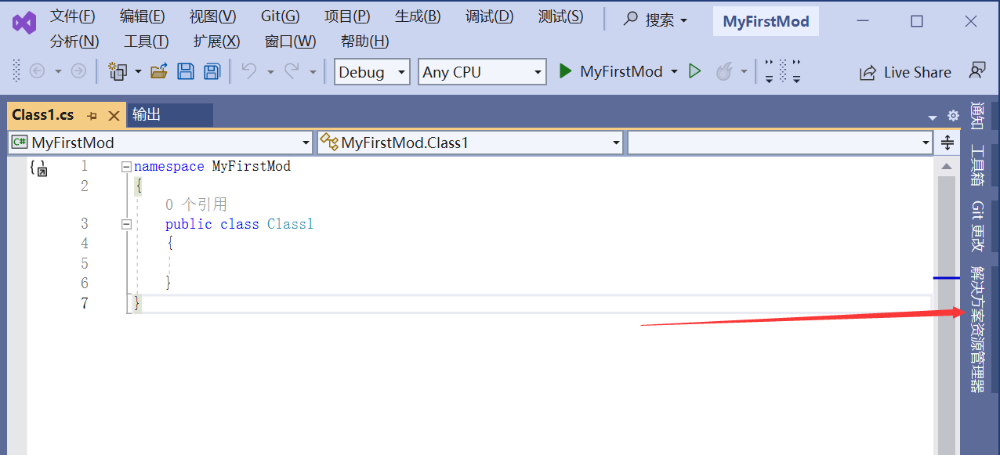
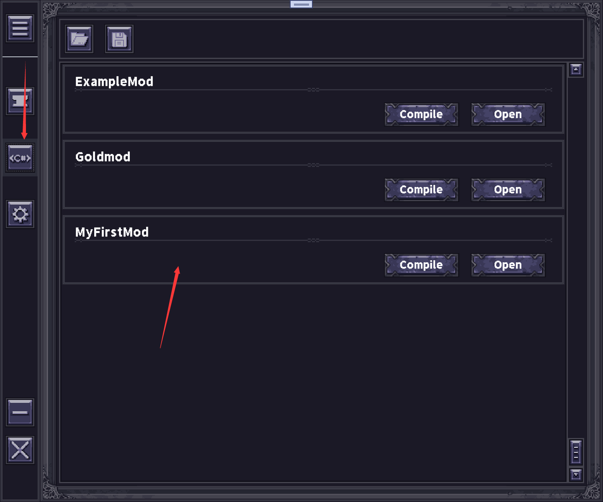
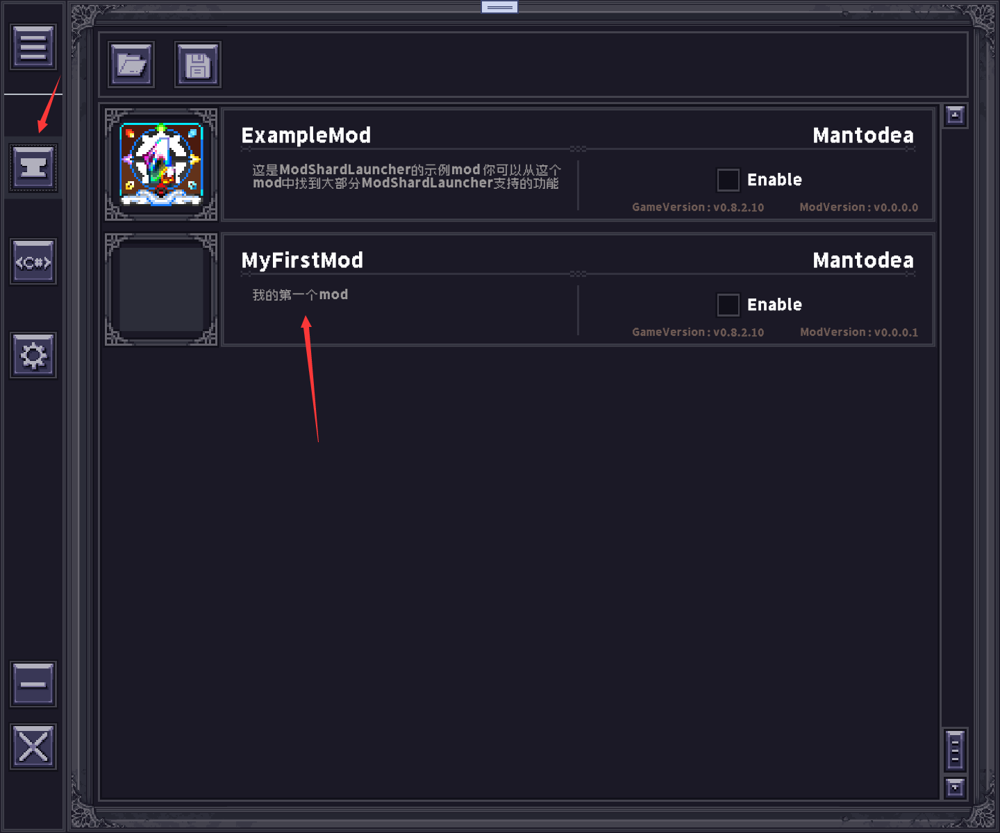
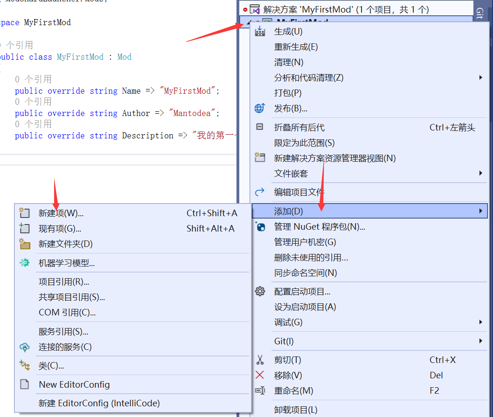
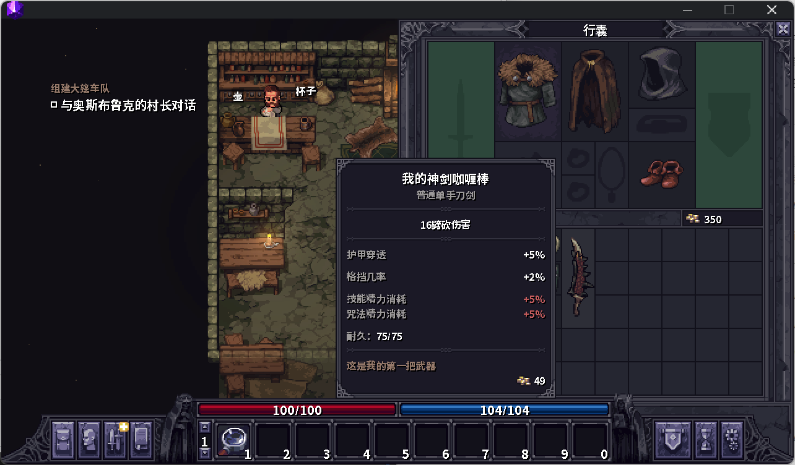

#  Let's begin!

## Before we start

---

Before creating a mod, you should have a basic understanding of C# and Visual Studio. <br>
If you do not know how to use them, please learn them first, as the tool's API can be a bit complex. <br>

Here are some resources to get you started on that :

- [C# Tutorial](https://www.w3schools.com/cs/index.php)
- [Visual Studio Tutorial](https://www.youtube.com/watch?v=VcU2HGsxeII&t=34s)

## Tools

---

In order to write your mod's code, you will need a tool such as [**Visual Studio**](https://visualstudio.microsoft.com/). <br> 
It's a professional development tool that can help you a lot.

While installing, make sure you choose the `.NET Desktop Development` workload. <br>
You do not need to download any other workload.

At last, find `.NET 6.0 SDK` on official Microsoft website, install it and when it's done, reboot your PC.

You can also use **Visual Studio Code** as your tool, but this tutorial won't cover it ~~cuz I havent tried it~~.

## Create your first mod

---

Let's start our journey by launching **ModShardLauncher.exe**. <br>
Once you start it, two folders should be created : the first is `Mods`, the other is `ModSource`. <br>

Move into the `ModSource` folder and create a **new folder** there. <br>
You can name this new folder whatever you want.

### Create your mod

There are many ways to create your mod. <br>
If you use **Visual Studio**, you can click `Create a New Project`, search `Class Library` and click `Next` :

<center> {: style="width:50%"} </center>

Give a name to your mod, then select the `ModSources` folder that **ModShardLauncher.exe** created earlier :
<center> {: style="width:50%"} </center>

Choose **.Net 6.0**, and that's it!
<center> {: style="width:50%"} </center>

<br>

### Assembly Reference

Next we should add a **reference** to the tool's **assembly**, which means the `ModShardLauncher.dll` file. <br><br>

Open the **solution explorer** on the right :
<center> {: style="width:50%"} </center>

Right click `Dependencies`, then click `Add Project Reference` :
<center> {: style="width:30%"} </center>

Click `Browse...` :
<center> {: style="width:50%"} </center>

Finally, select `ModShardLauncher.dll` and click `Add` :
<center> {: style="width:50%"} </center>

<br>

### Main class

Now we need to create a **Main Class** for our mod.

If you're familiar with **C#**, then you probably already know about **Classes**. <br>
We will now create our Mod's **main class**.

When you created your project, **Visual Studio** should have added a class named `Class1`. <br> 
We should add a reference to `ModShardLauncher` and to the `ModShardLauncher.Mods` namespace. <br>

Let's change the code to the following :
<center> {: style="width:50%"} </center>

As you can see, we changed the name of the class from `Class1` to `MyFirstMod`, and made this class extend the `Mod` class.

<br>

### Information of your mod

Now we need to add some basic information to our mod.

Let's add the following code to `MyFirstMod`:
<center> {: style="width:50%"} </center>

Once you've done this, the mod's name, creator and brief description will be set.

<br>

### Compile the Mod

Launch **ModShardLauncher**. <br>
As you can see, the mod's source code has been loaded.
<center> {: style="width:50%"} </center>

In order to **compile** the mod, we need to click the **folder icon** on the top left, and choose our **vanilla** `data.win` file.

??? question "Why does it need the vanilla `data.win` ?"

    This tool works based on the names of the objects in the **vanilla** `data.win` file.

??? question "Why do we need to load the `data.win` before compiling?"

    To prevent potential mismatch (and issues) between the **game version** and your **mod's version**.

We can now double click `MyFirstMod` to compile the mod.

Result of compiling :
<center> {: style="width:50%"} </center>

<br>

## Create your first weapon

---

You have compiled your first mod just now! <br> 
It's great but it's a bit empty right now, so let's add some content next.

### Create Weapon Class

Right click the **Solution Explorer**, right click your **project** (_the one highlighted in purple in the image_), <br>
click `Add`, and click `New Item...`
<center> {: style="width:30%"} </center>

Now you can name your weapon. For this tutorial I will name it `MyFirstWeapon`. <br>

Just like before, we can now add the reference for `ModShardLauncher` and the `ModShardLauncher.Mod` namespace. <br> 
However this time, we'll be extending the `Weapon` class rather than the `Mod` class.

??? note "MyFirstWeapon.cs"
    ```C# linenums="1"
    using ModShardLauncher;
    using ModShardLauncher.Mod;

    namespace MyFirstMod
    {
        public class MyFirstWeapon : Weapon
        {
            
        }
    }
    ```
<br>

### Change the information of your weapon

In StoneShard, there are many properties for a single weapon. <br>
It is painful to set them all by hand, and if you forget to set any of them, your mod may not load as expected.

??? question "Why is that ?"
    ~~Actually, cuz the source code of StoneShard is kinda messy...~~

Then, are there any ways that can help us easily change the properties of a weapon?

First, let's override the `SetDefaults` method :

??? note "MyFirstWeapon.cs"
    ```C# linenums="1" hl_lines="8-11"
    using ModShardLauncher;
    using ModShardLauncher.Mod;

    namespace MyFirstMod
    {
        public class MyFirstWeapon : Weapon
        {
            public override void SetDefaults()
            {
                
            }
        }
    }
    ```

??? info "If you feel like the code reminds you of tModLoader..."
    ~~It's because I may or may not come from the Terraria modding community.~~

As you can see, this method's purpose is to set a weapon's properties.
Now, let's introduce the **`CloneDefaults`** method.

That's right, to prevent modders from forgetting setting those properties, we offer a new method so that every properties will be copied from another vanilla weapon except `Name` and `ID`. <br>

All you have to do is add the following code :

??? note "MyFirstWeapon.cs"
    ```C# linenums="1" hl_lines="10-12"
    using ModShardLauncher;
    using ModShardLauncher.Mod;

    namespace MyFirstMod
    {
        public class MyFirstWeapon : Weapon
        {
            public override void SetDefaults()
            {
                CloneDefaults("Homemade Blade");
                Name = "MyFirstWeapon";
                ID = "MyFirstMod1";
            }
        }
    }
    ```

Now, we have a brand new weapon with the exact same properties as the `Homemade Blade` except for its **name** and **ID**.

!!! info "Notice"
    `CloneDefaults` won't set a value for the name or description in other languages.<br> 
    You need to change them manually, like so :
    ```C# linenums="1" hl_lines="13 14"
    using ModShardLauncher;
    using ModShardLauncher.Mod;

    namespace MyFirstMod
    {
        public class MyFirstWeapon : Weapon
        {
            public override void SetDefaults()
            {
                CloneDefaults("Homemade Blade");
                Name = "MyFirstWeapon";
                ID = "MyFirstMod1";
                Description[ModLanguage.English] = "This is my first weapon";
                NameList[ModLanguage.English] = "GreatFuckingSword";
            }
        }
    }
    ```

That's the first step of creating a weapon done.

### Sprite of your weapon

This is the most painful part. <br>
In StoneShard, you need 6 sprites for a weapon, which adds tons of work for modders.


If you don't have any sprites, you can export some of the vanilla sprites with **UTMT**. <br>
You can put them in your mod's folder or its subfolders, except in `.vs`, `bin` or `obj`. <br>
They will be patched into the `data.win` automatically.

<center> {: style="width:50%"} </center>

From top to bottom : <br>

- weapon in right hand
- weapon in left hand
- weapon in inventory (there are 3 sprites for this, since the weapon in StoneShard can be broken. <br> If you don't want to sprite it , just copy it 3 times)
- weapon as loot (dropped on the ground)

??? info "Notice"
    
    - The sprite size for weapons **in the inventory** must be at most `27*27 pixels` since a cell in StoneShard's inventory is exactly `27*27 pixels`. <br>
      Going above that would simply mean your weapon's sprite will be **too big to fit in a single cell**.
    - If making sprites for a **two-handed weapon**, you don't need `char_left`, as two-handed weapons cannot be used by just the left hand.

You can now run **ModShardLauncher.exe** again and repeat the compile steps described previously.

### Loading your mod

!!! warning "Important"
    You need to move the `ModShard.dll` file from the tool's root path to the root folder of the game. <br>
    This is how the tool hooks into Stoneshard. <br>

    Trying to load a modded data file without this will cause the game to crash. 

The last step is loading the mod. <br>

Once you've **compiled** your mod, it should pop up in the **mod list**. <br>
Head there and **tick the box** next to your mod to **enable** it. <br>
Next, click on the **floppy disk icon** in the **top left**, and **save** the new data file under any name. <br>

!!! info "Notice"
    Make sure you keep the vanilla `data.win` untouched, as you will need it to **make more mods** and to **play the game** vanilla.

I also recommend **renaming** your original `data.win` to `vanilla.win`. <br>

The reason for this is that at launch, Stoneshard looks for a `data.win` to load. <br>
If it doesn't find one, it will **ask you** to **select a data file**, which is is when we can tell it to **load** the **patched data file** we just saved. <br>


### Launch your game !

After launching the game, a new window should open alongside Stoneshard. <br> 
It is a control panel for the `Script Engine` that runs some inner script in game.

Enter the game as usual. <br> 

The script engine has a `give` script, so simply type the following in the new window's text box :
```
give MyFirstWeapon
```


You can give yourself **any weapon** in this way, but keep in mind you need to **replace any space** in the weapon's name with an **underscore** `_` :
```
give Homemade_Blade
```

Once you run the command, your weapon should be added to your inventory. <br>

<center> {: style="width:50%"} </center>